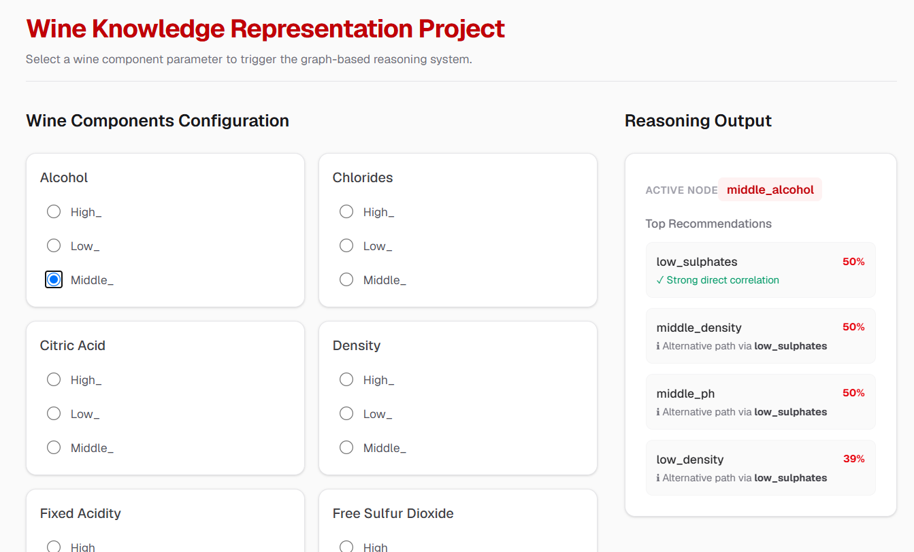

# Reccomendations Expert System

A small knowledge graph system that suggests, which components needed to create the best wine,
built for a Knowledge Representation course. The wine knowledge sits in `wine-reccomends-app/public/knowledge_base.json`, separate from the code.

## Run it on your computer locally
```bash
cd ./wine-reccomends-app
npm run dev
```

It starts a local server and opens the page in your browser at
`http://localhost:3000`. Leave that window open while you use it; press
Ctrl+C to stop.

## Rebuild the knowledge base (optional)

If you edit the dataset and want to regenerate `knowlevdge_base.json`:

```bash
pip install pandas, networkx, matplotlib
python data-builder/main.py
```

## How the reasoning works
vvV
For each component the engine asks: 
in the samples with the highest wine score (8) -
How many times (or how often) did a pair of these wine components appears? 
That fraction is the confidence, and
the matched components are shown.
- The `data-builder` just creates a knowledge graph. We change all numbers to 3 categories low middle or high.
After that the confidence matrix should be created.
- The last part is `wine-reccomends-app` where Apriori Algorithm `(WineRecommendationService)` is used to interpretate KG and eliminate all duplications of categories.
---

**Educational demonstration only - not actual winemaking advice.**

## Code snippet
